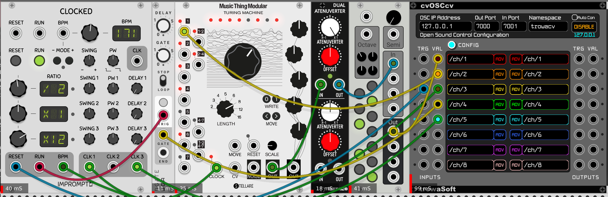

# OSC-to-MIDI
A simple script to receive notes and gates messages over Open Sound Control (OSC) and send MIDI commands to external hardware.

## How to use it
This script was conceived to create MIDI commands from CV values generated in VCV Rack and sent over OSC, through the almighty cvOSCcv module. 

### Setup:
- Load cvOSCcv into VCV Rack
- Connect the CV output of your sequencer/note generator to the Value input of `/ch/1` as if it is a 1 oct/CV input and the gate source to `/ch/2`.
- Launch your script with explicit niceness, in order to get decent timing: 
`nice -n -15 python3 path-to-script/osc-to-midi.py` 
At startup, the script will ask you to specify which MIDI OUT interface you want to send MIDI messages to.
- Click on `Config` button on cvOSCcv and then `Enable` the OSC client

